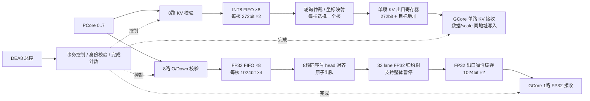

# DEA8 拼接归约模块设计方案

2026-10-08。KV 单路、两组浅 FIFO 的首版 RTL 已实现，并通过 Vivado 2022.2 功能仿真。目录为 `VLA/Collective/`，与 `V3/` 并列。未综合，尚未连接真实八核 PCore 和 GCore。

本次按用户要求改为资源节约的流式结构：两组浅 FIFO，每组八个；K/V 经轮询仲裁汇成一路，O/Down 按包对齐后归约；不等待完整 Tile、完整行或全部 51 行。取代此前统一 1024-bit×64 输入 FIFO、八核 KV 强制配组及统一宽出口缓存的提案。

## 1. 当前实现结构

| 项目 | 建议 |
|---|---|
| 功能 | K/V INT8 拼接；O/Down FP32 归约 |
| 控制 | DEA8 配置一个事务；模式由四类 op 推导 |
| INT8 输入 | 8 个 FIFO，每个有效载荷 272 bit、深度 2 |
| FP32 输入 | 8 个 FIFO，每个有效载荷 1024 bit、深度 4 |
| K/V 输出 | 1 路 valid/ready，272-bit 有效载荷，加核号/序号/目标地址 |
| O/Down 输出 | 1 路 valid/ready，1024-bit 有效载荷，加坐标/有效位 |
| KV 出口寄存器 | 1 项、272-bit 有效载荷，加元数据，支持消费/补入同拍 |
| FP32 出口缓存 | 深度 2、1024-bit 有效载荷 |
| 归约计算 | 32 lane 八输入 FP32 树，整个流水可同步暂停 |
| 发送规则 | 有可用分块就处理；不为凑整行、Tile 或矩阵而等待 |
| 目标 | 保证四类任务数值/存放正确，节约存储；KV 单路汇总每拍一包，容量耗尽时合法反压 |

两种模式共用事务控制、校验逻辑的实现模板、错误/完成管理；物理数据缓存按格式拆分。K/V 共用 INT8 组，O/Down 共用 FP32 组。四种 op 不需要四套缓存。



接收端按用户关于最终存放位置的要求理解为 GCore。八个 PCore 仍并行写各自输入 FIFO；Collective 对 GCore 只提供一路 KV valid/ready。一路采用 272-bit 数据宽度，未将八路数据隐藏在一个 2176-bit 超宽包中。单路收窄是吞吐取舍，详见第 8 节，不能继续承诺八核 KV 同时满速而永不反压。

## 2. 为什么按分块发送，而不按完整行发送

当前 PCore 的原生数据包已经适合流式处理，保留其数据形状最节省缓存和控制。

| 类型 | 一路输出的一次握手 | 有效载荷 | 完整矩阵 |
|---|---|---:|---|
| K | 两个 token 行，各 16 feature，带两个 scale | 272 bit | 八核拼成 `[51,256]` |
| V | 两个 feature 列，各 16 token，带两个 scale | 272 bit | 八核拼成 `[51,256]` |
| O | 两个 token 行，各 16 feature 的八核归约结果 | 1024 bit | `[51,1024]` |
| Down | 同 O | 1024 bit | `[51,1024]` |

**“两行”仅指两个行片段，不是两个完整的 256/1024 列长行。** V 也不强行变为“两行”：其 scale 沿 token 维组织，直接保留两列×16 token。

- 拆成单行：总数据量不变；相同每拍包数下吞吐减半，若保持吞吐需增加端口/频率，且增加拆包控制。
- 凑完整行：PCore 按 feature Tile 输出多行，不按全矩阵完整行连续输出。凑齐全列需要额外重排缓存。
- 凑齐 51 行：引入 Tile/整矩阵等待与存储，本模块没有这种计算依赖。
- 保留原生包：K/V 不做算术；O/Down 对当前两个行片段独立求和即可。

推荐就使用表中粒度。GCore 按坐标增量写入目标存储；下游若需要完整行，使用其目标存储已有的数据，不在 Collective 再复制一份。

## 3. 两组 FIFO 的大小及作用

### 3.1 INT8：每核 272 bit × 2

每项包含两份 `16INT8 + 8-bit scale`。数据与 scale 共用一次入队/出队，不再设置独立 scale FIFO。

用途仅为一个带缓冲的转发接口：保持输出、吸收短暂反压，便于布线和流水切分。深度 2 不表示要收够两包才输出，第一包有效且下游 ready 即可发送。应支持同时入队/出队，稳态 II=1。

八核纯载荷容量：

```text
8 × 2 × 272 / 8 = 544 byte
```

当前 PCore 的 `dea8_pcore_egress_v3` 已有两项保持型缓冲，但八路汇成单路需要选择、保持选中数据，并吸收短时仲裁等待。因此保留当前 INT8 浅 FIFO；不再推荐作为本轮基线直接旁路。

轮询仲裁取一个非空 FIFO 的 head，送入一项 KV 出口寄存器。该寄存器空，或其旧数据本拍被 GCore 接收时，可以接收新包；FIFO 只在新包被寄存器实际接受时 pop，轮询指针也只在此时推进。寄存器非空且 GCore 不 ready 时，数据和全部元数据保持不变。

轮询跳过空核，不等待八核都有效；八核都有数据且下游持续接收时，每核每八次仲裁服务获得一次机会。独立输入 FIFO 可同时写入，但输出汇总每拍只有一包。出口寄存器是必要的单项保持，不增加深层 KV 输出队列。

### 3.2 FP32：每核 1024 bit × 4

每项就是本核两个行片段的 32 个 FP32。八核纯载荷容量：

```text
8 × 4 × 1024 / 8 = 4096 byte
```

用途是吸收小幅核间错位和归约通路短暂停顿。深度 4 为初始实现建议，不是已从实际八核 trace 验证的最优值；后续参数化测试 2/4/8 即可。

只要八核各有一个对应 head，就可以立即归约。没有 `tile_complete`、`received_count>=26` 或 FIFO 填满的启动条件。

快核领先超过缓存容量时，对快核反压；慢核对应 FIFO 仍可接收，不能因某个快核 FIFO 满就关闭所有核入口，否则可能阻止缺失操作数到达。

### 3.3 载荷存储预算

| 存储 | 纯数据容量 |
|---|---:|
| 8 个 INT8 FIFO，272×2 | 544 byte |
| 8 个 FP32 FIFO，1024×4 | 4096 byte |
| 1 项 KV 出口寄存器，272 bit | 34 byte |
| 1 个 FP32 出口 FIFO，1024×2 | 256 byte |
| 合计 | **4930 byte，约 4.81 KiB** |

相较此前八路统一输入 FIFO 的 64 KiB，仅新的两组输入载荷为 4640 byte，减少约 92.9%。这不包括元数据、计数、配置、valid、FP32 加法流水及其旁带寄存器，也不代表整个模块的物理资源仅有 4.81 KiB。

这么浅且宽的 FIFO 初步采用寄存器/小型存储实现，不强行占用宽拼接 BRAM。最终映射由综合验证。既有 PCore 输出缓冲保留，但不将其容量自动计作 Collective 的独立保证。

单事务、每核有序输入条件下，完整 Job 存一份配置；每项不重复保存完整 Job。先检查输入原始 tile/index/mask/last，再用入队/出队序号重建规则坐标。流水中只携带需要的序号、有效位等信息。

## 4. K/V：作为带地址的中转站

K/V 不需要八核同步配组。core0 的第 5 包可以先获得仲裁发送，core7 的第 3 包随后发送；两者写入不同的目标坐标，没有归约依赖。

输入八路独立 valid/ready，出口仅一个 valid/ready。每核各有接收/出队/实际发送进度；八核之间不要求一致的包序号。GCore 反压时出口寄存器保持，仲裁暂停；输入 FIFO 尚有空间的核仍可继续入队。

“拼接完成”通过所有数据被写入同一逻辑矩阵的不同坐标实现，不要求线上先构造一个超宽完整行。这是地址化拼接；GCore 必须接受这种分块布局。

### 4.1 K 坐标

对 core c、tile t、pair p、向量 r、元素 i：

```text
token   = token_origin + 2*p + r
feature = expected_job[c].rope_pair_base + 128*t + i
```

标准映射要求 core0..7 的 rope_pair_base 为 0,16,...,112。每核两半分别覆盖低 128 列和高 128 列的对应分段。不能按“每核连续 32 列”直接拼接 K。

两份 scale 各自属于一个行的 16-feature 组，原样转发。末 pair 只写 row50，row51 无效。每核 52 包，共 416 次单路出口握手。

### 4.2 V 坐标

对 core c、tile t、index j、向量 r、元素 i：

```text
token   = token_origin + 16*(j/8) + i
feature = 32*c + 16*t + 2*(j%8) + r
```

每份 scale 对应一列内的 16 token。j=24..31 的 token_mask=0x0007，其余为 0xffff。每核 64 包，共 512 次分路握手。

不将 V 按 K 的逐行 feature-B16 格式解释，也不把无效 token 补零后当成有效结果。

token_origin 非 16 对齐时，量化组仍是本地 token block，不自动变成全局对齐块。GCore/KVB 需支持该分段布局；与服务器 prefix 合并重分组/重新量化不属于这个中转模块。

## 5. O/Down：按包对齐、立即归约

### 5.1 发射条件

```text
all_heads_valid
&& all_heads 对应当前事务的同一序号
&& reduction_pipeline_can_advance
```

满足条件时八核一起 pop，一个 group 的 32 组八核标量进入归约树。某核暂缺数据时保留其他 head，不输出部分核之和。

每核按接收序号检查源端坐标；归约侧还有组序号计数。当前固定 profile：

```text
tile = sequence / 26
pair = sequence % 26
token_base = 2*pair
feature_base = 16*tile
```

O/Down 每核 1664 包，八核合成 1664 个输出包。row50 的末半包有效位为 01。

### 5.2 算术结构

保留 32 lane，每 lane 对八核同坐标做固定树形 FP32 求和：

```text
层1：(0+1)、(2+3)、(4+5)、(6+7)
层2：((0+1)+(2+3))、((4+5)+(6+7))
层3：两份结果相加
```

每节点单独 FP32 舍入；目标为 round-to-nearest ties-to-even，subnormal、NaN/Inf、signed zero 规则须在选取组件时明确。位精确 gold 按相同树序计算，不用双精度一次求和或串行求和替代。

共 32×7=224 个 FP32 流水加法器，这是保持八核各一包/拍峰值的算术结构。此次优化减少缓存和不必要的重排，不把吞吐减半作为隐藏代价。FP32 加法器实例数不等于 DSP 数量；资源适配 U50 的结论仍需后续综合。

三层树可以有多拍流水，要求启动间隔 II=1。无效 row51 的操作数送 +0，输出屏蔽；身份、序号、mask 与数值同步推进。

### 5.3 通过暂停流水节省出口缓存

建议使用支持统一 clock-enable 的 FP32 流水，所有树层寄存器及旁带使用同一个 advance 条件：

- 出口两项 FIFO 可接收时，整个流水前进一步；末级 valid 有效则入队。
- 当前没有八核 group 时，流水仍可前进，首级注入 valid=0，已在途数据继续排出。
- 出口 FIFO 满且本拍不出队时，所有树层、结果及旁带保持，不再 pop 输入 group。
- 八路输入 FIFO 在此期间仍可独立接收，直到各自容量耗尽。

如此在途结果保留在本来就需要的加法流水寄存器中，不另外配置按全流水延迟计算的大型结果 FIFO。出口两项 FIFO 支持出队与入队同时发生；GCore 持续 ready 时可持续 II=1。

前提是所选 FP32 组件确实支持所有内部状态一致暂停。若组件不支持 CE，不能只冻结末级或停止输入并假定在途结果不再出现；需改用 credit 预留出口空间，缓存必须覆盖在途结果。实现时优先满足可暂停组件条件，不直接套用非停顿 IP 再省略必要缓存。

同一 advance 控制扇出较大，后续物理实现需检查时序；不能随意对各树层分别延迟 CE。暂停后的时延按“有效推进拍”计算，不再是固定的绝对时钟拍数。

## 6. 单路 GCore 接口与正确存放

### 6.1 一路接口

KV 与 FP32 保留两个不同用途的端口；本次“一路”指 KV 从八路改为一路，不把它与 FP32 再合并。

| 接口 | 数量 | 数据宽度，不含元数据 | 含义 |
|---|---:|---:|---|
| `g_kv_valid/ready/packet` | 1 | 272 bit | 仲裁选出的一个核的 K/V 分块 |
| `g_reduce_valid/ready/packet` | 1 | 1024 bit | 八核归约后的两个行片段 |
| `collective_cmd_valid/ready` | 1 | 描述符 | DEA8 配置事务 |
| `collective_done_valid/ready` | 1 | 事务身份、状态 | 全部结果完成发送 |

建议 KV packet 至少携带以下语义，最终位宽通过参数定义：

| 字段 | 建议宽度/来源 | 用途 |
|---|---|---|
| collective_id、destination_id、op/layout | 当前描述符 | 区分对象、K/V 和布局 |
| core_id | 3 bit | 本包来源核 |
| source_sequence | 6 bit | 本核序号，K 0..51，V 0..63 |
| word_index | 9 bit | 目标对象内的字地址，K 0..415，V 0..511 |
| vector_valid | 2 bit | K 的尾行控制；V 两列均有效 |
| token_mask | 16 bit | V 的尾 token 控制；K 使用约定的 feature 有效掩码 |
| data、scale | 256 bit、16 bit | 两个原生量化向量 |
| core_last、job_last | 各 1 bit | 本核末包、整个事务末包 |

tile/index 可由 source_sequence 推导，不再为它们重复设置必需字段。word_index 在 Collective 计算，GCore 根据 core_id、source_sequence 和当前 layout 复核；只校验通过才允许写入。

KV 出口寄存器接受新包时保存所有字段。在 valid=1、ready=0 时，任何字段均不得改变，不能因另一个核 FIFO 刚刚变为非空而切换仲裁结果。

core_last 不等于 job_last。job_last 对应整个事务第 416 个 K 包或第 512 个 V 包，并且所有核的序号/数量检查均合法；不得使用“core7 的 last”作为完成依据。

### 6.2 GCore 中的目标对象

以下是建议新增的 GCore 本地存储布局，不是已存在的 GCore RTL 或已经分配的 HBM 地址：

```text
K_DATA[destination][0..415] : 每字 256 bit
K_SCALE[destination][0..415]: 每字 16 bit

V_DATA[destination][0..511] : 每字 256 bit
V_SCALE[destination][0..511]: 每字 16 bit
```

数据和 scale 逻辑分开、字地址完全相同，一次握手同步写入。也可物理合并为 272-bit 存储字，地址语义不变。两种形式只选一种，不同时保留两份副本。

字内布局固定为 `DATA[8*(16*r+i)+:8]` 保存向量 r 的第 i 个 INT8，`SCALE[8*r+:8]` 保存该向量的 scale（r=0..1，i=0..15）。scale 按原始 8-bit 编码传递，不在中转站重解释成 FP32。端口的 packed array 声明顺序若不同，由边界适配器显式转换，不能靠隐式拼接猜测高低位。

`destination_id` 由 DEA8 在 Collective 和 GCore 两侧提前配置为同一个目标对象，可映射到各自 DATA/SCALE 的基地址。物理字地址为 `data_base+word_index` 和 `scale_base+word_index`；基地址单位是各存储的“字”，不是混用的字节地址。本文不虚构尚未设计的 GCore 绝对地址。

此对象保存当前 PCore 输出的 51-token 分段。token_origin 放在对象描述符中，读出时恢复绝对 token；不因 prefix 长度而改变当前局部字地址，不覆盖已有 prefix 对象。对象占用期间不得重用 destination_id；取消、重用需要明确的生命周期管理。

K 纯有效载荷存储为 416×34=14144 byte，V 为 512×34=17408 byte。这是 GCore 保存最终 K/V 所需的分块目标存储，**不是新增在 Collective 的中转缓存**；只有 GCore 确实需要同时保留两个对象时才同时配置这些容量。

### 6.3 K 的地址：feature block × row pair

标准 RoPE 布局下，对 core c、source_sequence q：

```text
t            = q / 26                 // 0..1
p            = q % 26                 // 0..25
feature_tile = 8*t + c                // 0..15
word_index   = 26*feature_tile + p     // 0..415
```

一般映射中 `feature_tile=rope_pair_base[c]/16+8*t`，但初版要求 rope_pair_base[c]=16*c，配置时检查，避免映射重叠。

该字的第 r 个向量、第 i 个元素对应：

```text
K[token_origin + 2*p+r, 16*feature_tile+i]
K_SCALE[word_index][r] 属于该行的这 16 个 feature
```

例：core3、tile1、pair2 的字地址为 `(8+3)*26+2=288`，存本地 row4/5、feature176..191。其低/高两份 scale 分别属于 row4 和 row5，不能合并。

pair25 只有 row50 有效。允许全字写入，但无效 row51 的数据/scale 清零，读者按布局忽略；不能将它认作第 52 个有效 token。写全字不需要先读出旧值做 read-modify-write。

### 6.4 V 的地址：feature pair × token group

对 core c、source_sequence q：

```text
t            = q / 32                 // 0..1
j            = q % 32                 // 0..31
g            = j / 8                  // 0..3
f            = j % 8                  // 0..7
feature_pair = 16*c + 8*t + f         // 0..127
word_index   = 4*feature_pair + g      // 0..511
```

该字的第 r 个向量、第 i 个元素对应：

```text
V[token_origin + 16*g+i, 2*feature_pair+r]
V_SCALE[word_index][r] 属于该列的这 16 个 token
```

例：core3、tile1、j10 时，g=1、f=2、feature_pair=58、word_index=233；写 feature116/117、本地 token16..31 的两份向量与 scale。

g3 只存 token48..50，mask=0x0007，其余数据字节清零；scale 仍是原本有效 token 形成的那个 B16 scale，不能因补零再重新计算。

K、V 地址都与包的到达先后无关。轮询顺序变化只改变写入时间，不改变最终位置。固定 profile 下每个合法来源包恰好对应一个唯一字，K 覆盖 416 字，V 覆盖 512 字。

### 6.5 数据如何真正提交

GCore 接收器保存事务描述符和每核 next_sequence，依次检查身份、op/layout、范围、顺序、word_index、mask 和边界。

```text
fire = g_kv_valid && g_kv_ready
```

只有 fire 且该包合法时，DATA 与 SCALE 同时写同一个 word_index，更新该核 next_sequence 和总提交数。ready 必须代表两处存储均有写入能力；不能只接收 data、随后丢失对应 scale。单路每拍一个包，两个逻辑存储各一个写端口即可，不需要八 bank 同时写。

如果 GCore 使用同步 RAM 且握手当拍完成写入，可在最后写入生效后置对象 valid。若 GCore 接收端还带写队列，则区分“接收计数”和“实际写入计数”；对象 valid 和 GCore commit 必须等所有写入真正完成。

K：每核 52、总计 416；V：每核 64、总计 512。数量正确、各核末包正确、写流水排空后才发布对象完成。Collective done 只代表出口全部被接收；DEA8 还须按 GCore commit 判断 K/V 可以被后续使用。

错误或取消后，已经写入的数据无需逐字清空，但对象 valid 必须保持无效；下一次重新占用对象并完整写入后才可重新发布。

### 6.6 O/Down 的位置也带对象身份

归约结果仍走已有单路 1024-bit 接口。建议 GCore 的 FP32 对象按 `word_index=tile*26+pair` 存 1664 个字，每字两行×16FP32，另有 row_valid。元素位置为 `[2*pair+r,16*tile+i]`，O 与 Down 由 destination_id 区分，不通过到达顺序判断对象。若后续使用流式 residual，可由 GCore 消费该坐标包，而不强制再建一份完整矩阵缓存。

## 7. 控制与身份：保持单事务

DEA8 先配置 Collective，再允许对应 PCore Job 发射数据。描述符保留：

- collective_id、op、destination_id、token_origin、layout；
- expected_job[8]，记录各核实际控制 Job；
- 固定 profile 的包数/尺寸由 op 导出，避免维护互相矛盾的配置。

不同核的 head、core_id、RoPE 起点、核内 command token 可不同，不要求完整 Job 跨核相等。每核分别匹配自己的 expected_job，再归入同一个 collective_id。O/Down 当前包的本地 token 为零，不能作为事务身份。

状态可简化为 IDLE → RUN → DONE，以及异常状态 FAULT：

1. IDLE 接收合法描述符，清理本事务计数/valid，进入 RUN。
2. RUN：K/V 轮询仲裁单路发送；O/Down 对应包到齐即归约；不设置整 Tile 就绪状态。
3. 全部输入数量正确、所有输出实际握手、FIFO 和流水 valid 排空后进入 DONE。
4. done 保持到 DEA8 接收，再回到 IDLE。下一事务不与当前事务共享 FIFO 生命周期。

未参与当前模式的 PCore 通道不接收；若发送与已配置 op 不符的数据，报告协议错误。输入检查覆盖 Job、核号、顺序、坐标、mask、数量和边界。FIFO 深度不同不影响这些检查。

PCore done 仍表示本核最后数据被接收；Collective done 表示数据处理后全部交给 GCore。GCore 存储真正提交若另需时间，应另有提交事件，由 DEA8 决定后续启动。

取消/错误时停止产生新的有效结果；已被 GCore 接收的部分结果必须按事务标记无效。重新开放前协调源端/目的端撤销旧事务，不能只清内部 FIFO 就忽略外部仍保持的旧 valid。

## 8. 吞吐与反压约定

不要求包与包之间连续，不要求 Tile 内不能断流。设计保证 ready/valid 下任意气泡和停顿均不丢、不重、不串坐标。

正常持续供给且 GCore ready 时：

- KV 汇总每拍一包，非空核轮询服务；不等所有核到齐；
- O/Down 在八份对应数据齐备后，每拍可启动一组；
- 流水充满后 FP32 出口每拍一包；
- KV 峰值已因单路 272-bit 仲裁收窄；FP32 归约仍保留原有每拍一组的目标。

浅缓存只吸收小幅错位。深度 4 不等于“任意八核相差四拍也永不反压”，应按累计未被消费的包数计算占用；输出持续停顿时按协议反压。

资源节约方案接受超出缓冲能力时的合法反压，而不为任意长停顿配置整事务缓存。是否增加实际 PCore Job 完成时间，需要用八核实际输出 trace 验证，不能在只有单核日志时声称完全没有影响。

当前 250MHz 仅为设计目标。KV 单路 272-bit 出口为 8.5GB/s，有效 INT8 数据部分为 8GB/s；原八核同时供数峰值为 68GB/s，不能靠浅 FIFO 永久弥补这 8 倍差异。FP32 八核入口汇总仍为 256GB/s、归约出口 32GB/s。这些均是片内载荷带宽，不是 HBM 带宽。

本次单路选择明确放弃“KV 八核持续满速也不反压”的峰值承诺，以满足单路、窄接口和省资源要求。正常任务期间是否仍可隐藏 KV 传输，需使用实际 PCore 输出 burst 验证。若后续要求峰值完全不降，则需增宽单路数据总线或提升接收能力，而不能保留 272 bit 却承诺无代价。

## 9. 数量与时间统计

| 类型 | 输入总包数 | 对 GCore 的实际握手数 | 无气泡服务段 |
|---|---:|---:|---|
| K | 416 | 单路 416 | 416 拍，加通路延迟 |
| V | 512 | 单路 512 | 512 拍，加通路延迟 |
| O | 13312 | 单路 1664 | 1664 拍，加归约流水延迟 |
| Down | 13312 | 单路 1664 | 同 O |

K/V 服务拍数只表示所有待发包可持续获得服务且 GCore ready 常高的情况；不再使用“52/64 个八核原子输出 group”的口径，也不等同于矩阵任务增加了 416/512 拍。总开销取决于与矩阵计算重叠的部分。

以上不含矩阵供数间隔，也不是从 DEA8 Job 发起到完成的固定周期。仿真应分别记录源端计划发送、实际接收、输出发送、done 时间，以及停顿原因和 FIFO 高水位。

## 10. 实现划分与验证

建议保持少量模块：

| 模块 | 职责 |
|---|---|
| `dea8_collective_top` | 事务配置、八核校验/计数、模式、错误和完成 |
| 通用浅弹性 FIFO | 参数化宽度/深度，实例化 INT8×8、FP32×8、FP32结果×1 |
| KV 轮询与出口寄存器 | 顶层内实现，选核、字地址生成、272-bit 单项保持 |
| `dea8_collective_reduce` | 对齐发射、可暂停的 32-lane 归约树及旁带 |
| `dea8_collective_pkg` | 公共描述符和 packet 类型 |

KV 坐标映射与轮询仲裁在顶层实现，先不单独增加“重排引擎”“整行拼接器”或 Tile 管理模块。顶层可以按代码可读性抽出小型入口模块，但不新增物理存储副本。

后续 TB 验收：

1. 模拟八核 K/V/O/Down 完整事务，核间数据不同，逐元素核对坐标与数值。
2. 验证 KV 轮询跳过空核、不饿死非空核；GCore 停顿期间单路 packet 稳定，消费/补入可同拍进行。
3. FP32 只给每核一包即能启动；在任意 pair 中插入气泡，不要求 Tile 连续。
4. 八核同步满速、GCore ready 常高时，KV 单路每拍发送一包并对超额输入正确反压；FP32 归约仍要求 II=1。
5. GCore 随机长短停顿，尤其在 FP32 树有多个在途结果时暂停，检查各层/旁带稳定、恢复后的顺序和数值。
6. 快核 FIFO 满时慢核仍能补齐数据，无死锁；观察深度 2/4/8 的占用和实际 Job 时间，再决定是否调整 FP32 深度。
7. K 的 RoPE 两半坐标、V token-B16 及末组三 token、FP32 row50 尾包逐项验证。
8. 完整树序 FP32 gold、异常数值、错误 Job/顺序/last、取消恢复及保持型 done 均验证。
9. 枚举每个核每个合法包，在 GCore 内存模型核对 DATA/SCALE 同地址写、唯一地址覆盖、尾部屏蔽；随机交错核顺序后最终 K/V 矩阵必须一致。
10. 接入真实 PCore 出口 trace 与 GCore 接收模型，测量单路 KV 仲裁造成的等待、整体任务完成时间和实际写入 commit。

以上为阶段验收要求，已执行的项目与残留验证范围见第 11 节。当前 GCore 存储写入通过 TB 模型验证；真实 GCore 接收/提交逻辑尚未实现于本目录。

已在本轮执行地址枚举检查：K 的 416 个字、V 的 512 个字均无重复且覆盖完整范围；两种布局各自恰好覆盖 51×256=13056 个有效矩阵元素，无重叠、越界或遗漏。有效 scale 组分别为 K 816 组、V 1024 组。此结果验证地址公式，不代替 RTL 握手/写入仿真。

## 11. 首版 RTL 与当前验证结果

### 11.1 代码及依赖

| 文件 | 当前内容 |
|---|---|
| `rtl/dea8_collective_top.sv` | 单事务控制、原始包校验、两组 FIFO、KV 轮询、地址生成、完成/错误管理 |
| `rtl/dea8_collective_fifo.sv` | 浅寄存器 FIFO，支持同拍入队出队；数据不清零，仅复位指针/计数 |
| `rtl/dea8_collective_fp_add.sv` | 四拍 FP32 对阶、加减、规格化、舍入，统一 advance |
| `rtl/dea8_collective_reduce.sv` | 224 个加法器，三级树共 12 个推进拍；valid/序号同步暂停 |
| `rtl/dea8_collective_pkg.sv` | Collective 描述符、完成、KV/FP32 输出包与地址函数 |
| `tb/tb_collective.sv` | 八核发送模型、单路 GCore 存储模型、FP32 gold 比较及异常注入 |
| `tb/make_vectors.py` | 独立精确整数 binary32 参考算法，生成 1024 组八输入及树形结果 |
| `collective.f`、`run_sim.ps1` | 源码列表、生成向量、编译/展开/仿真、显式 PASS 与哈希检查 |

当前边界直接采用既有 `pcore_control_pkg::collective_packet_t` 和 `control_job_t`，不会修改这些定义。FP32 算术复用 `V3/rtl/dea8_fp32_v3_pkg.sv` 中的整数逻辑函数，未复用 PCore 的 RAM、调度状态或归约存储。它们均列在 `collective.f` 中作为只读依赖；当前 `Collective` 不是脱离 V3 包即可独立编译的工程。

顶层参数 `KV_DEPTH=2`、`FP_DEPTH=4`。八核、51 行、16 元素向量以及三层树对应当前固定 profile；包中的 destination_id/token_origin 沿接口传递，不在模块内分配 GCore 存储。

### 11.2 顶层控制边界

- `cmd_valid/ready`：仅 IDLE 接收；配置八核 expected_job，op 为 COLLECT_K/COLLECT_V/REDUCE_O/REDUCE_DOWN。
- `done_valid/ready`：成功完成后保持，握手后回 IDLE；错误完成握手后继续保留 FAULT，直到 clear。
- `cancel`：运行中停止当前事务并报告 COL_CANCELLED；取消会废弃内部在途数据。
- `clear`：同步丢弃所有内部事务/有效位并回 IDLE，外部旧包必须已撤销；不是完整系统 flush 握手。
- `kv_valid/ready[7:0]`、`fp_valid/ready[7:0]`：分别连接各 PCore 的 kv_out 和 reduce_out；未选模式出现 valid 会报告错误。
- `g_kv_valid/ready`：单路量化包，272-bit 载荷；`g_fp_valid/ready`：单路归约结果，1024-bit 载荷。实际 struct 宽度还包括元数据，应使用 `$bits` 获取。

FP32 树每层四拍，共 12 个有效推进拍。出口反压时整个树保持；没有新 group 时注入无效项，已有结果继续排出。结果 FIFO 深度 2，包含输出元数据。RAM/加法器映射和 4ns 时序均尚无综合证据。

### 11.3 已运行的仿真

在 `Collective/` 内执行：

```powershell
powershell -ExecutionPolicy Bypass -File .\run_sim.ps1
```

默认 Vivado 路径为 `D:\Xilinx\Vivado\2022.2`；Python 路径可通过 `-Python` 参数替换。Vivado 的 C 编译辅助进程需要可用的进程权限。脚本不仅检查退出码，还拒绝 Fatal/Error、要求显式 `tb_collective PASS`，并确认运行期间所有源文件/向量哈希不变。

2026-10-08 当前源码仿真结果：

| 事务 | 每核输入包数 | GCore 输出包数 | TB 计时拍数 | 条件 |
|---|---:|---:|---:|---|
| K | 52 | 416 | 611 | 核间气泡、GCore 周期性反压 |
| V | 64 | 512 | 754 | 同上 |
| O | 1664 | 1664 | 2402 | 核间气泡、长短出口停顿 |
| Down | 1664 | 1664 | 1679 | 八核连续输入、GCore ready 常高 |
| K 取消/错误恢复后再运行 | 52 | 416 | 419 | 连续供给、GCore ready 常高 |

时间从 TB 配置握手结束后到 done 可见统计，包含 FIFO/树流水与完成判断；不是从真实 PCore 矩阵 Job 下发开始的总时间，也不是布局布线后的性能结果。

显式结果：`tb_collective PASS jobs=5 faults=8 kv_stalls=12154 fp_stalls=4434 tree_stalls=712`。

已检查完整 K/V 目标内存的所有 51×256 数据和 scale、唯一字地址及尾部清零；O/Down 每个有效结果按独立整数参考算法的树形 FP32 结果逐位比较。向量包括随机位模式、相近指数抵消、舍入边界、subnormal、Inf/NaN 和 signed zero。

8 项异常测试覆盖错误 feature 地址、早 last、Job 身份、vector_valid、token_mask、错误模式通道、非法配置以及树中已有在途结果时取消。验证了 FAULT 保持、clear 后正常新事务、done 保持、出口数据在反压时稳定。当前停顿由可重复的周期模式产生，尚未执行随机种子扫描。

证据：`reports/tb_collective.log`、`reports/simulation_summary.txt`、`reports/sources_sha256.csv`。日志 PASS 只适用于该哈希记录对应的源码。

### 11.4 下一步

接入实际 PCore 出口 trace 和真实 GCore 存储/提交接口，测量单路 KV 对任务完成的影响。随后补不同 FIFO 深度、随机延迟、重复/超额包与更完整取消场景的回归。当前未提供综合、资源或 250MHz 时序结论。
